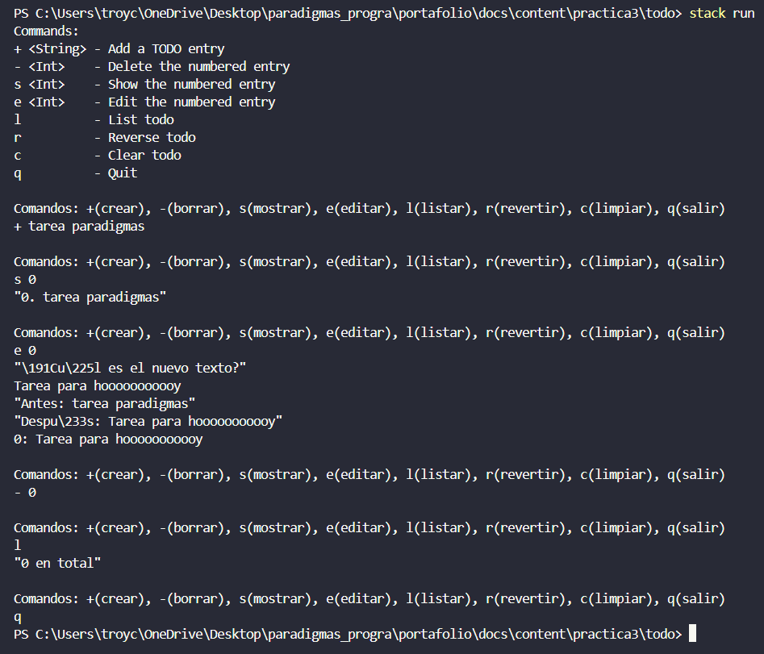

+++
date = '2026-02-19T22:08:21-08:00'
draft = false
title = 'Practica3: El paradigma funcional'
+++

# Práctica 3 — Aplicación TODO en Haskell


## ¿Qué es Haskell?

Haskell es un lenguaje de programación funcional puro, de tipado estático y evaluación perezosa (*lazy evaluation*). A diferencia de los lenguajes imperativos que había usado antes, en Haskell los programas se construyen mediante la composición de funciones matemáticas, evitando el estado mutable y los efectos secundarios. Al principio me pareció un lenguaje muy extraño, pero fui descubriendo lo poderoso que puede ser: el código es más predecible, seguro y conciso que en muchos otros lenguajes.

---

## 1. Instalación del entorno

### 1.1 Instalar Stack

Lo primero que hice fue instalar **Stack**, la herramienta oficial para gestionar proyectos en Haskell. Stack se encarga de instalar automáticamente el compilador GHC y todas las dependencias necesarias, lo cual me facilitó mucho el proceso.

Descargué el instalador para Windows desde el siguiente enlace y lo ejecuté:

[https://get.haskellstack.org/stable/windows-x86_64-installer.exe](https://get.haskellstack.org/stable/windows-x86_64-installer.exe)

Una vez terminada la instalación, abrí PowerShell y verifiqué que Stack quedara correctamente instalado con:

```powershell
stack --version
```

### 1.2 Extensiones para VS Code

Para trabajar más cómodamente, instalé las siguientes extensiones en Visual Studio Code:

- **Haskell** (Haskell Language Server)
- **Haskell Syntax Highlighting**
- **Error Lens**

También instalé `hlint`, un linter que me ayudó a escribir mejor código Haskell:

```powershell
stack install hlint
```

---

## 2. Crear el proyecto

Para crear el proyecto me ubiqué en la carpeta de esta práctica y usé el comando `stack new`:

```powershell
cd C:\Users\troyc\OneDrive\Desktop\paradigmas_progra\portafolio\docs\content\practica3
stack new todo
cd todo
```

Stack generó automáticamente la siguiente estructura de archivos, que al principio me pareció bastante, pero entendí que cada parte tiene su función:

```
todo/
├── app/
│   └── Main.hs        ← Punto de entrada de la aplicación
├── src/
│   └── Lib.hs         ← Lógica principal de la app
├── test/
│   └── Spec.hs        ← Pruebas unitarias
├── package.yaml       ← Configuración de dependencias
└── stack.yaml         ← Configuración del resolver de Stack
```

---

## 3. Configurar dependencias

Abrí el archivo `package.yaml` y agregué las dependencias que necesitaba bajo la sección `dependencies`:

```yaml
dependencies:
  - base >= 4.7 && < 5
  - dotenv
  - open-browser
```

- **dotenv** me permite leer variables de entorno desde un archivo `.env`.
- **open-browser** me permite abrir URLs directamente desde la aplicación.

---

## 4. Código fuente

### 4.1 `app/Main.hs`

Este es el punto de entrada de la aplicación. Aquí simplemente muestro los comandos disponibles al usuario y llamo a la función `prompt` con una lista vacía para iniciar la app:

```haskell
module Main where

import Lib (prompt)

main :: IO ()
main = do
    putStrLn "Comandos disponibles:"
    putStrLn "+ <texto>  - Agregar una tarea"
    putStrLn "- <Int>    - Eliminar la tarea número N"
    putStrLn "s <Int>    - Mostrar la tarea número N"
    putStrLn "e <Int>    - Editar la tarea número N"
    putStrLn "l          - Listar todas las tareas"
    putStrLn "r          - Revertir el orden"
    putStrLn "c          - Limpiar la lista"
    putStrLn "q          - Salir"
    prompt []  -- Inicio con la lista vacía
```

### 4.2 `src/Lib.hs`

Aquí coloqué toda la lógica de la aplicación. Definí el ciclo principal con `prompt`, el intérprete de comandos con `interpret`, y varias funciones auxiliares para manipular la lista de tareas. Lo más interesante fue aprender a usar **pattern matching** para manejar cada comando de forma elegante:

```haskell
module Lib
  ( prompt,
    editIndex,
  )
where

import Data.List

putTodo :: (Int, String) -> IO ()
putTodo (n, todo) = putStrLn (show n ++ ": " ++ todo)

prompt :: [String] -> IO ()
prompt todos = do
  putStrLn ""
  putStrLn "Ingresa un comando:"
  command <- getLine
  if "e" `isPrefixOf` command
    then do
      print "¿Cuál es el nuevo texto para esa tarea?"
      newTodo <- getLine
      editTodo command todos newTodo
    else interpret command todos

interpret :: String -> [String] -> IO ()
interpret ('+' : ' ' : todo) todos = prompt (todo : todos)
interpret ('-' : ' ' : num) todos =
  case deleteOne (read num) todos of
    Nothing -> do
      putStrLn "Número no encontrado en la lista"
      prompt todos
    Just todos' -> prompt todos'
interpret ('s' : ' ' : num) todos =
  case showOne (read num) todos of
    Nothing -> do
      putStrLn "Número no encontrado en la lista"
      prompt todos
    Just todo -> do
      print $ num ++ ". " ++ todo
      prompt todos
interpret "l" todos = do
  print $ show (length todos) ++ " tarea(s) en total"
  mapM_ putTodo (zip [0 ..] todos)
  prompt todos
interpret "r" todos = do
  print $ show (length todos) ++ " tarea(s) en total"
  mapM_ putTodo (zip [0 ..] (reverseTodos todos))
  prompt todos
interpret "c" _ = do
  print "Lista limpiada."
  prompt []
interpret "q" _ = return ()
interpret command todos = do
  putStrLn ("Comando inválido: `" ++ command ++ "`")
  prompt todos

deleteOne :: Int -> [a] -> Maybe [a]
deleteOne 0 (_ : as) = Just as
deleteOne n (a : as) = do
  as' <- deleteOne (n - 1) as
  return (a : as')
deleteOne _ [] = Nothing

showOne :: Int -> [a] -> Maybe a
showOne n todos =
  if n < 0 || n > length todos then Nothing
  else Just (todos !! n)

editIndex :: Int -> a -> [a] -> [a]
editIndex i x xs = take i xs ++ [x] ++ drop (i + 1) xs

editTodo :: String -> [String] -> String -> IO ()
editTodo ('e' : ' ' : num) todos newTodo =
  case showOne (read num) todos of
    Nothing -> do
      putStrLn "Número no encontrado"
      prompt todos
    Just old -> do
      print $ "Antes:  " ++ old
      print $ "Después: " ++ newTodo
      let newTodos = editIndex (read num :: Int) newTodo todos
      mapM_ putTodo (zip [0 ..] newTodos)
      prompt newTodos
editTodo _ todos _ = prompt todos

reverseTodos :: [a] -> [a]
reverseTodos xs = go xs []
  where
    go [] ys     = ys
    go (x:xs) ys = go xs (x : ys)
```

---

## 5. Ejecutar la aplicación

Desde la carpeta `todo/` en PowerShell, compilé y ejecuté la aplicación con:

```powershell
stack run
```

La primera vez que corrí este comando, Stack tardó varios minutos porque tuvo que descargar el compilador GHC y todas las dependencias. Las siguientes ejecuciones fueron mucho más rápidas.

---

## 6. Funcionamiento de la aplicación

Al iniciar, la app muestra el menú de comandos y queda esperando que yo escriba algo. La lista de tareas vive **en memoria** durante la sesión, lo que significa que al salir con `q` los datos no se guardan.

### Comandos disponibles

| Comando | Ejemplo | Qué hace |
|---|---|---|
| `+ <texto>` | `+ tarea paradigmas` | Agrega una tarea nueva al inicio |
| `l` | `l` | Lista todas las tareas numeradas |
| `- <N>` | `- 0` | Elimina la tarea número N |
| `s <N>` | `s 1` | Muestra solo la tarea número N |
| `e <N>` | `e 0` | Edita la tarea número N |
| `r` | `r` | Muestra la lista en orden inverso |
| `c` | `c` | Limpia toda la lista |
| `q` | `q` | Sale del programa |

### Ejemplo de sesión que probé



---

## 7. Conceptos de Haskell que apliqué

| Concepto | Dónde lo usé |
|---|---|
| **Pattern matching** | `interpret ('+' : ' ' : todo)`, `deleteOne` |
| **Recursión** | `deleteOne`, `reverseTodos`, `prompt` |
| **Tipos `Maybe`** | `deleteOne` y `showOne` retornan `Maybe` para manejar errores |
| **I/O Monads** | `prompt` e `interpret` usan notación `do` |
| **Listas inmutables** | La lista de tareas es un `[String]` que nunca se muta |
| **Funciones de orden superior** | `mapM_`, `zip`, `isPrefixOf` |

--- 

## Referencias

- [Repositorio del proyecto to-do](https://github.com/steadylearner/Haskell/tree/main/examples/blog/todo)
  
#### Enlace de mi portafolio en Github
https://github.com/Troy2404/portafolio_paradigmas.git
#### Enlace de mi página estática en Github Pages
https://troy2404.github.io/portafolio_paradigmas/

