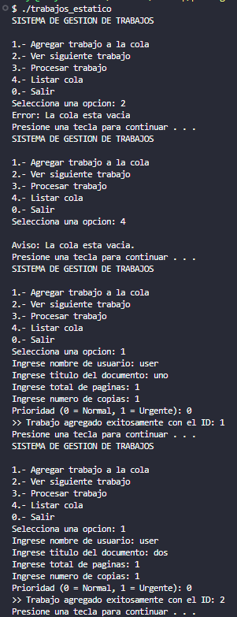
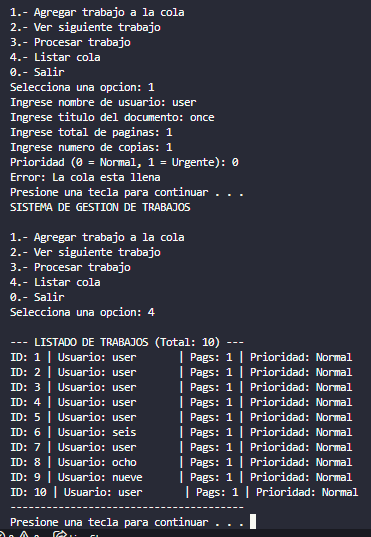
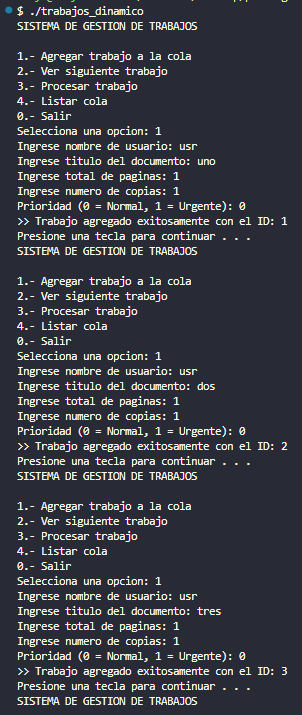
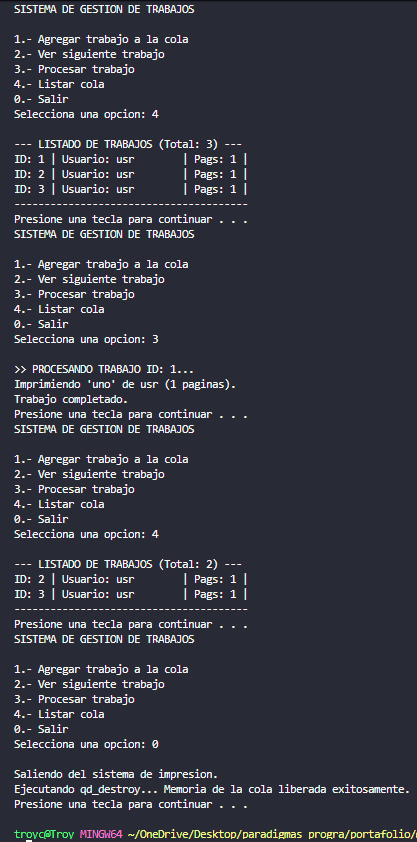
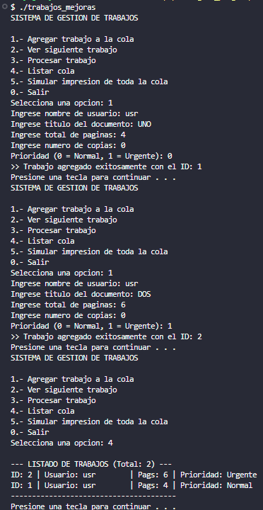
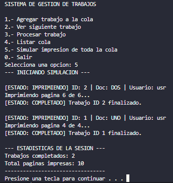

+++
date = '2026-02-19T22:07:26-08:00'
draft = true
title = 'Practica1: Elementos básicos de los lenguajes de programacion'
+++

# Reporte de Práctica 1: Cola de Impresión en Lenguaje C

> **Materia:** 40032 - Paradigmas de la Programación  
> **Docente:** M.I. José Carlos Gallegos Mariscal  
> **Grupo:** 941  
> **Equipo:**
> - González Borbas Fernando Alberto — Matrícula: 379792
> - Moreno Calderón Troy Leonardo — Matrícula: 379169
> - Rojas Arroyo Kenan — Matrícula: 379748

---

## 1. Introducción

En esta práctica se desarrolló un simulador de cola de impresión en lenguaje C que administra trabajos enviados por distintos usuarios. El objetivo fue comprender el manejo de memoria estática y dinámica, el diseño de subprogramas con contratos claros, y el uso correcto de estructuras de control y tipos de datos.

Una **cola FIFO** (*First In, First Out*) es la estructura que más se adapta para este problema porque los trabajos de impresión deben atenderse en el mismo orden en que fueron enviados, garantizando equidad entre usuarios. El proyecto se desarrolló en tres sesiones: primero con un arreglo fijo (memoria estática), luego con una lista enlazada (memoria dinámica), y finalmente con simulación de impresión, prioridades y estadísticas.


---

## 2. Diseño

### 2.1 Estructura `PrintJob_t` y sus campos

```c
#define MAX_USER 32
#define MAX_DOC  48

typedef enum { NORMAL = 0, URGENTE = 1 } Prioridad_t;

typedef enum {
    EN_COLA = 0, IMPRIMIENDO = 1, COMPLETADO = 2, CANCELADO = 3
} Estado_t;

typedef struct PrintJob_t {
    int id;                  // Identificador autoincremental único
    char usuario[MAX_USER];  // Usuario que envió el trabajo
    char documento[MAX_DOC]; // Título del documento
    int totalPgs;            // Total de páginas del documento
    int restantePgs;         // Páginas aún por imprimir (simula progreso)
    int copias;              // Número de copias solicitadas
    int msPagina;            // Retraso en ms por página (para simulación)
    Prioridad_t prioridad;   // NORMAL o URGENTE
    Estado_t estado;         // EN_COLA, IMPRIMIENDO, COMPLETADO, CANCELADO
} PrintJob_t;
```

`restantePgs` se inicializa igual a `totalPgs` y se decrementa página por página durante la simulación. El campo `estado` permite rastrear el ciclo de vida completo del trabajo. Los enums evitan usar enteros mágicos (0, 1, 2, 3), mejorando la legibilidad y reduciendo errores.

### 2.2 Cola Estática (`QueueStatic_t`)

```c
#define MAX_JOBS 10

typedef struct QueueStatic_t {
    PrintJob_t datos[MAX_JOBS];
    int size;
} QueueStatic_t;
```

El frente siempre es `datos[0]` y el último elemento válido es `datos[size-1]`. Enqueue agrega al final en O(1); dequeue extrae `datos[0]` y desplaza todos los demás hacia la izquierda en O(n).

```
[ datos[0] | datos[1] | ... | datos[size-1] | vacío | ... ]
  ↑ frente                    ↑ final
```

**Invariantes:**
- `0 <= size <= MAX_JOBS`
- Si `size == 0` la cola está vacía; si `size == MAX_JOBS` está llena
- El frente siempre es `datos[0]`

### 2.3 Cola Dinámica (`QueueDynamic_t`)

```c
typedef struct Node_t {
    PrintJob_t job;
    struct Node_t *next;
} Node_t;

typedef struct QueueDynamic_t {
    Node_t *head;  // Apunta al frente
    Node_t *tail;  // Apunta al final
    int size;
} QueueDynamic_t;
```

Gracias al puntero `tail`, tanto enqueue como dequeue son O(1), eliminando el costoso desplazamiento de la versión estática.

```
head → [Job1 | •] → [Job2 | •] → [Job3 | NULL]
                                     ↑
                                    tail
```

**Invariantes:**
- Si `head == NULL` entonces `tail == NULL` y `size == 0`
- Si `head != NULL`, entonces `tail->next == NULL`
- `size` coincide exactamente con el número de nodos enlazados

---

## 3. Implementación

### 3.1 Funciones de la Cola Estática

| Función | Descripción |
|---|---|
| `qs_init(q)` | Inicializa `size = 0` |
| `qs_is_empty(q)` | Retorna 1 si `size == 0` |
| `qs_is_full(q)` | Retorna 1 si `size == MAX_JOBS` |
| `qs_enqueue(q, job)` | Agrega `job` al final; retorna 0 si la cola está llena |
| `qs_peek(q, out)` | Copia `datos[0]` en `*out` sin modificar la cola |
| `qs_dequeue(q, out)` | Extrae `datos[0]`, desplaza los demás, decrementa `size` |
| `qs_print(q)` | Recorre e imprime todos los trabajos en orden |

### 3.2 Funciones de la Cola Dinámica

| Función | Descripción |
|---|---|
| `qd_init(q)` | Inicializa `head = tail = NULL`, `size = 0` |
| `qd_is_empty(q)` | Retorna 1 si `head == NULL` |
| `qd_enqueue(q, job)` | Reserva nodo con `malloc`, valida `NULL`, lo enlaza al tail |
| `qd_peek(q, out)` | Copia `head->job` en `*out` sin modificar la cola |
| `qd_dequeue(q, out)` | Extrae el nodo `head` y lo libera con `free` |
| `qd_print(q)` | Recorre la lista e imprime cada trabajo |
| `qd_destroy(q)` | Libera **todos** los nodos restantes al salir del programa |

### 3.3 Decisiones relevantes

**Manejo de prioridades en `qd_enqueue`:** Al insertar un trabajo `URGENTE`, se recorre la lista hasta encontrar el primer trabajo `NORMAL` y se inserta justo antes, sin necesidad de una segunda cola.

**`fgets` + `strtol` en lugar de `scanf`:** `scanf` puede dejar caracteres en el buffer y falla silenciosamente con entradas inválidas. `fgets` lee la línea completa y `strtol` convierte a entero de forma controlada.

---

## 4. Demostración de conceptos

### 4.1 Alcance y duración de variables

#### Snippet 1 — Variable local (duración de bloque)

```c
// Dentro del case 1 del switch en main()
PrintJob_t nuevoTrabajo;
nuevoTrabajo.id = contId;
// ...
if (qd_enqueue(&cola, nuevoTrabajo)) { ... }
```

**Justificación:** `nuevoTrabajo` es local al bloque `case 1`. Solo necesita existir mientras se capturan los datos del trabajo. Al llamar `qd_enqueue`, el trabajo se copia dentro del nodo y `nuevoTrabajo` ya no tiene utilidad. Declararla global sería innecesario y contaminaría el espacio de nombres.

#### Snippet 2 — Variable local persistente entre iteraciones

```c
// Al inicio de main()
int op, contId = 1;
// ...
// Dentro del case 1, tras agregar exitosamente:
contId++;
```

**Justificación:** `contId` se declara en `main()` y persiste durante toda la ejecución gracias al ciclo `do-while`. Se eligió como local de `main` (no global) porque ninguna otra función necesita acceder al contador directamente. Si fuera global, estaría expuesta a modificación accidental desde cualquier función.

#### Snippet 3 — Parámetro puntero (duración de llamada)

```c
int qd_enqueue(QueueDynamic_t *q, PrintJob_t job) { ... }
```

**Justificación:** El parámetro `q` es una variable local a la función cuya duración abarca solo la llamada. Como es un puntero a la cola declarada en `main`, las modificaciones sobre `q->head` y `q->tail` persisten en la estructura original. Sin el puntero, los cambios se perderían al retornar.

---

### 4.2 Memoria: dónde se reserva y dónde se libera

#### Snippet — Reserva en heap (`malloc`)

```c
// En qd_enqueue:
Node_t *newNode = (Node_t *)malloc(sizeof(Node_t));
if (newNode == NULL) {
    return 0;  // malloc falló; se informa al llamador con retorno 0
}
newNode->job = job;
newNode->next = NULL;
```

Cada vez que se agrega un trabajo, se reserva un bloque en el **heap** del tamaño exacto de un `Node_t`. El puntero `newNode` es local, pero el bloque en el heap persiste hasta ser liberado explícitamente.

#### Snippet — Liberación individual (`free` en `qd_dequeue`)

```c
Node_t *temp = q->head;
*out = temp->job;
q->head = q->head->next;
if (q->head == NULL) { q->tail = NULL; }
free(temp);   // Se libera el nodo procesado
q->size--;
```

Cada vez que un trabajo se procesa, su nodo se libera inmediatamente. Esto evita acumular memoria de trabajos ya atendidos.

#### Snippet — Liberación total (`qd_destroy`)

```c
void qd_destroy(QueueDynamic_t *q) {
    Node_t *current = q->head;
    Node_t *next_node;
    while (current != NULL) {
        next_node = current->next;
        free(current);
        current = next_node;
    }
    q->head = NULL;
    q->tail = NULL;
    q->size = 0;
}
```

`qd_destroy` se llama al seleccionar la opción 0 (Salir). Recorre toda la lista liberando nodo por nodo y deja la estructura en un estado seguro.

**¿Qué pasa si se olvida llamar `qd_destroy`?**

Si el programa termina sin llamar `qd_destroy`, todos los nodos que quedaban en la cola permanecen en el heap sin ser liberados: esto se denomina **fuga de memoria** (*memory leak*). En este programa el sistema operativo recupera la memoria al terminar el proceso, por lo que no hay consecuencia visible en esta escala. Sin embargo, en un servidor de larga duración, un sistema embebido, o una biblioteca reutilizable, las fugas acumuladas degradan el rendimiento y pueden agotar la memoria disponible. La regla es: por cada `malloc` debe haber exactamente un `free`.

---

### 4.3 Contratos: función que modifica vs. función que solo consulta

#### Funciones que modifican la cola — reciben `*q`

```c
int qd_enqueue(QueueDynamic_t *q, PrintJob_t job);
int qd_dequeue(QueueDynamic_t *q, PrintJob_t *out);
void qd_destroy(QueueDynamic_t *q);
```

Reciben un puntero sin `const` porque su contrato es **alterar** la cola: agregar nodos, removerlos, o liberarlos. El compilador permite escribir `q->head = newNode`.

#### Funciones que solo consultan — reciben `const *q`

```c
int qd_peek(const QueueDynamic_t *q, PrintJob_t *out);
void qd_print(const QueueDynamic_t *q);
int qd_is_empty(const QueueDynamic_t *q);
```

El calificador `const` es una garantía en tiempo de compilación: si dentro de `qd_peek` se escribiera `q->head = NULL` accidentalmente, el compilador produciría un error. El contrato es explícito y comprobable: estas funciones solo leen, nunca modifican.

---

## 5. Preguntas 

### ¿Dónde guardaste el contador de `id` y por qué?

El contador se declaró como variable local en `main()`:

```c
int op, contId = 1;
```

Se eligió esta ubicación porque solo `main` necesita asignarlo al crear un nuevo trabajo. Ninguna función de la cola requiere conocer el siguiente ID disponible; esa responsabilidad pertenece exclusivamente al código que crea los trabajos. Declararlo global hubiera expuesto el contador a modificaciones accidentales desde cualquier función del programa.

---

### En la versión dinámica: ¿qué función libera memoria? ¿Cómo lo verificas?

Hay dos responsables:

- **`qd_dequeue`** — libera cada nodo individualmente cuando el trabajo es procesado con `free(temp)`.
- **`qd_destroy`** — libera todos los nodos restantes al salir del programa (opción 0 del menú).

Para verificarlo se puede usar **Valgrind** en Linux:

```bash
valgrind --leak-check=full ./printq
```

Si al salir reporta `All heap blocks were freed -- no leaks are possible`, la gestión es correcta. También se puede agregar un `printf` dentro de `qd_destroy` que cuente cuántos nodos liberó y compararlo contra `q->size` antes de llamarla.

---

### ¿Qué invariantes mantiene tu cola?

**Cola estática (`QueueStatic_t`):**
- `0 <= size <= MAX_JOBS` siempre
- Si `size == 0`, la cola está vacía; peek y dequeue retornan 0
- Si `size == MAX_JOBS`, la cola está llena; enqueue retorna 0
- El frente siempre es `datos[0]`; no hay índice front separado

**Cola dinámica (`QueueDynamic_t`):**
- Si `head == NULL` entonces `tail == NULL` y `size == 0`
- Si `head != NULL`, entonces `tail->next == NULL`
- `size` coincide exactamente con el número de nodos en la lista
- Nunca existe un nodo accesible que apunte a memoria ya liberada

---

### ¿Por qué `peek` no debe modificar la cola?

Porque su única responsabilidad es **observar** el frente sin comprometerse a procesarlo. Si `peek` removiera el elemento, una segunda llamada consecutiva devolvería un trabajo diferente, haciendo impredecible el comportamiento y rompiendo el invariante FIFO.

Existen casos de uso válidos donde se necesita inspeccionar el siguiente trabajo para decidir si conviene procesarlo en este momento (por ejemplo, verificar si la prioridad es `URGENTE` antes de iniciar). Si `peek` modificara la cola en ese punto, la decisión quedaría tomada antes de que el programador lo eligiera. El calificador `const` fuerza este contrato en compilación:

```c
int qd_peek(const QueueDynamic_t *q, PrintJob_t *out);
```

---

### ¿Cómo distingues entre "cola llena" y "entrada inválida"?

Ambas situaciones hacen que el trabajo no se agregue, pero el origen es diferente y se detecta en distintos puntos:

| Situación | Dónde se detecta | Mensaje al usuario |
|---|---|---|
| **Cola llena** (versión estática) | Dentro de `qs_enqueue`, al evaluar `qs_is_full` | `"Error: La cola esta llena"` |
| **Entrada inválida** (ej. páginas ≤ 0) | En `main()`, antes de llamar a enqueue | `"Error: paginas debe ser > 0"` |
| **`malloc` falla** (versión dinámica) | Dentro de `qd_enqueue`, al verificar `newNode == NULL` | `"Error: No se pudo asignar memoria"` |

En la versión estática, una cola llena es un límite estructural del arreglo. En la dinámica, el equivalente es que `malloc` retorne `NULL` por falta de RAM. Ambos se propagan al llamador con el valor de retorno `0`, pero con mensajes distintos para que el usuario entienda la causa real del fallo.

---

## 6. Análisis Comparativo: Cola Estática vs. Dinámica

### 6.1 Diferencias en límite y capacidad

| | Estática | Dinámica |
|---|---|---|
| Capacidad | Fija: `MAX_JOBS = 10` | Ilimitada (acotada por RAM disponible) |
| Si se llena | `enqueue` rechaza el trabajo | No aplica en condiciones normales |
| Cambiar capacidad | Requiere modificar `#define` y recompilar | No requiere ningún cambio en el código |

### 6.2 Complejidad temporal de operaciones

| Operación | Estática | Dinámica |
|---|---|---|
| `enqueue` | O(1) | O(1) |
| `dequeue` | **O(n)** por el desplazamiento (*shift*) | O(1) |
| `peek` | O(1) | O(1) |
| `print` | O(n) | O(n) |

El punto crítico es `dequeue` en la versión estática: al eliminar `datos[0]`, todos los elementos restantes se desplazan una posición. Con `MAX_JOBS = 10` es insignificante, pero en sistemas con miles de trabajos el costo se vuelve relevante. Una alternativa sin migrar a lista enlazada sería una **cola circular** con índices `front` y `rear`, que llevaría `dequeue` a O(1) en la versión estática.

### 6.3 Costo de memoria

| | Estática | Dinámica |
|---|---|---|
| Memoria reservada | Siempre `MAX_JOBS * sizeof(PrintJob_t)` aunque haya 0 trabajos | Solo lo necesario: un nodo por trabajo activo |
| Overhead por elemento | 0 bytes extra | 8 bytes extra por el puntero `next` (sistemas 64-bit) |
| Ubicación | Stack de `main()` | Heap |
| Riesgo de fragmentación | No aplica | Posible tras muchos `malloc`/`free` sucesivos |

### 6.4 Impacto en alcance y duración de variables

En la versión estática, el arreglo `datos[MAX_JOBS]` vive en el stack de `main()` y su duración es la ejecución completa del programa. En la versión dinámica, cada nodo nace en el heap con `malloc` y muere con `free`; su duración es controlada explícitamente por el programador.

El contador `contId` tiene el mismo alcance en ambas versiones (local a `main`). Las variables temporales como `nuevoTrabajo`, `frente` y `procesado` son locales a cada `case` del switch; su duración abarca solo la iteración en que se usan y se descartan automáticamente al salir del bloque.

### 6.5 Riesgos por versión

| Riesgo | Estática | Dinámica |
|---|---|---|
| Capacidad agotada | Cola llena → rechaza trabajos | No aplica en condiciones normales |
| Fuga de memoria | No aplica | Olvidar `qd_destroy` al salir |
| Puntero a NULL | No aplica | No validar el retorno de `malloc` |
| Puntero colgante (*dangling pointer*) | No aplica | Usar un nodo después de liberarlo con `free` |

### 6.6 Errores encontrados y cómo se mitigaron

**1. `tail` incorrecto al eliminar el último nodo:**
En `qd_dequeue`, cuando se extrae el único nodo de la lista, `head` queda `NULL` pero `tail` seguía apuntando al nodo ya liberado. La siguiente llamada a `enqueue` enlazaba al tail inválido, causando comportamiento indefinido. Se corrigió con:
```c
if (q->head == NULL) { q->tail = NULL; }
```

**2. `printf` con especificador `%s` sin argumento (`trabajos_dinamico.c`):**
El formato `"... | Estado: %s\n"` tenía un especificador de cadena sin argumento correspondiente, provocando comportamiento indefinido (lectura de memoria arbitraria). Se detectó con la advertencia `-Wall` y se corrigió en `trabajos_mejoras.c`.

**3. Ambas ramas del `if` de prioridad imprimían `"Urgente"` (`trabajos_dinamico.c`):**
Tanto el `if (prioridad == URGENTE)` como el `else` ejecutaban `printf("Urgente\n")`, haciendo que todos los trabajos se listaran como urgentes. Se corrigió en la versión de mejoras para imprimir `"Normal"` en el caso `else`.

---

## 7. Simulación

La simulación (opción 5 del menú en `trabajos_mejoras.c`) procesa toda la cola mostrando el avance página por página:

```c
while (!qd_is_empty(q)) {
    PrintJob_t job;
    qd_dequeue(q, &job);

    job.estado = IMPRIMIENDO;
    printf("[ESTADO: IMPRIMIENDO] ID: %d | Doc: %s | Usuario: %s\n",
           job.id, job.documento, job.usuario);

    while (job.restantePgs > 0) {
        printf("\rImprimiendo pagina %d de %d...",
               (job.totalPgs - job.restantePgs + 1), job.totalPgs);
        fflush(stdout);
        Sleep(job.msPagina);   // 500 ms por página
        job.restantePgs--;
    }

    job.estado = COMPLETADO;
    printf("\n[ESTADO: COMPLETADO] Trabajo ID %d finalizado.\n", job.id);
}
```

**Flujo de estados:** `EN_COLA` → `IMPRIMIENDO` → `COMPLETADO`

El `\r` hace que el cursor regrese al inicio de la línea, sobreescribiendo el número de página anterior y produciendo un efecto de progreso animado. `fflush(stdout)` fuerza la salida inmediata del buffer antes del `Sleep`. Al finalizar se muestran estadísticas: trabajos completados y total de páginas impresas.


---

## 8. Conclusiones


Con esta práctica aprendimos de manera práctica la diferencia entre manejar memoria de forma estática y dinámica. Al principio parecía que usar un arreglo fijo era suficiente, pero cuando migramos a la lista enlazada nos dimos cuenta de que la versión estática tiene limitaciones reales: no solo el límite de 10 trabajos, sino también el costo de desplazar todos los elementos cada vez que se procesa uno. Entender por qué dequeue es O(n) en la versión estática y O(1) en la dinámica fue uno de los puntos más claros de la práctica.
Algo que nos llamó la atención fue el uso de const en los parámetros de las funciones. Al principio lo veíamos como algo opcional o decorativo, pero en realidad es una forma de decirle al compilador qué funciones tienen permitido modificar la cola y cuáles no, lo que evita errores difíciles de detectar. También aprendimos que liberar memoria no es algo que el programa haga solo: si no se llama qd_destroy, los nodos quedan abandonados en el heap aunque el usuario ya haya salido del menú. Si pudiéramos mejorar algo, le añadiríamos una opción para cancelar trabajos por ID y probablemente implementaríamos la versión estática con cola circular para no tener que desplazar elementos en cada dequeue.

---

## 9. Referencias

GeeksforGeeks en Español. (2024). Estructura de datos cola. https://es.wikipedia.org/wiki/Cola_(inform%C3%A1tica)

GeeksforGeeks. (2024). Queue data structure. https://www.geeksforgeeks.org/queue-data-structure/

GeeksforGeeks. (2024). Linked list implementation of queue. https://www.geeksforgeeks.org/queue-linked-list-implementation/

GeeksforGeeks. (2024). Static and dynamic memory allocation in C. https://www.geeksforgeeks.org/difference-between-static-and-dynamic-memory-allocation-in-c/

GeeksforGeeks. (2024). Dynamic memory allocation in C using malloc(), calloc(), free() and realloc(). https://www.geeksforgeeks.org/dynamic-memory-allocation-in-c-using-malloc-calloc-free-and-realloc/

---

## Evidencia de Ejecución

*NOTA: Dentro de los códigos, quitamos los `system("CLS")` para que se pudieran apreciar de una mejor manera las capturas. 

### Sesión 1 — Cola Estática



*Para no hacerlo tan extenso omitimos la captura del llenado completo de los 10 trabajos, 
la siguiente imagen muestra el resultado final de la cola llena despues de haber puesto los 10 trabajos.*



### Sesión 2 — Cola Dinámica (flujo FIFO)







### Sesión 3 — Simulación y Mejoras






*El mensaje "Imprimiendo pagina X de Y..." incluye un delay de 500 ms por página 
mediante Sleep(), sin embargo al ser una captura no es posible apreciarlo por aqui, obviamente.*
